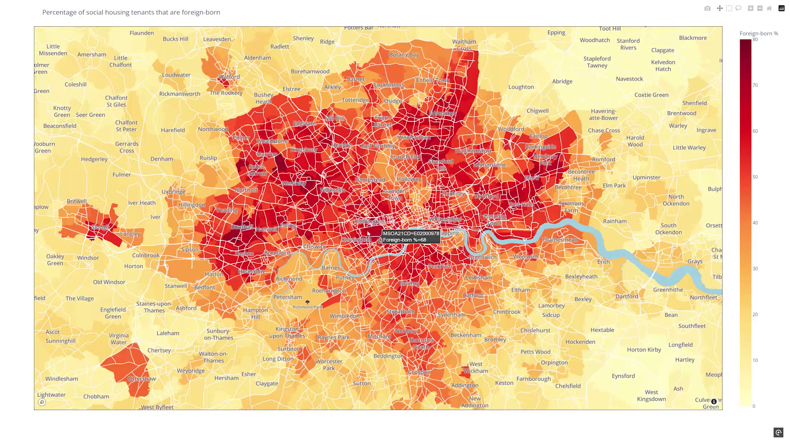

# social-housing-map

The included Python script generates a choropleth map that shows the proportion of social housing in England &amp; Wales that is occupied by people born outside the United Kingdom.

Requires a free [mapbox](https://www.mapbox.com/) account as well as a Python environment with the packages `pandas`/`geopandas` and `plotly`.

The included geojson file must be decompressed, on OSX/Linux you can simply run:

`gunzip MSOA_2021_EW_BGC_V2_1370945015033551734.geojson.gz`

This is version 2 of the boundaries file, which is what I used. If you want the latest version (V3), which is a slightly bulkier file, you can find the link in the table below. 

## Data sources

| File  | Source |
| ------------- | ------------- |
| `MSOAs_housing.csv`  | [ONS Census 2021 for England and Wales](https://www.ons.gov.uk/datasets/create/filter-outputs/4f0ac35b-6d3b-4f17-bb28-82b4fcdd057f#get-data)  |
| `MSOA_2021_EW_BGC_V2_1370945015033551734.geojson.gz`  | [Open Geography portal](https://www.data.gov.uk/dataset/837e3858-51bc-449a-a5b7-d0d6a87b995b/middle-layer-super-output-areas-december-2021-boundaries-ew-bgc-v2) [no longer available].  |
| `Middle_layer_Super_Output_Areas_December_2021_Boundaries_EW_BGC_V3_4916445166053426.geojson` (not included) | [Open Geography portal](https://geoportal.statistics.gov.uk/datasets/6b282db29762450881ed5159259a6e4e_0)

